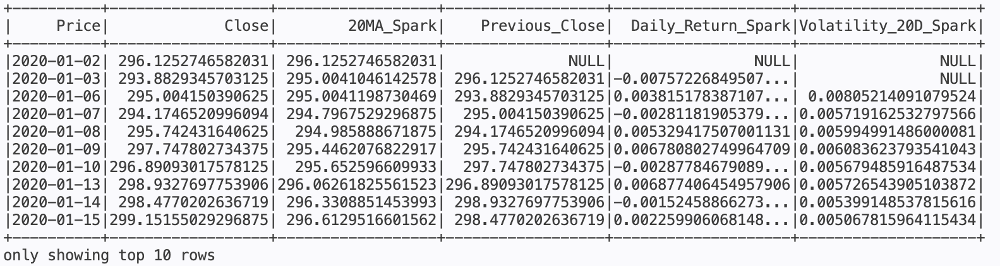

# Trading Data Pipeline

A Data Engineering project that extracts financial market data,
processes it using Pandas and PySpark, and stores the results in
CSV and Parquet formats.

## Project Workflow

```text
Yahoo Finance
        ↓
   Extract Data
        ↓
      Pandas
        ↓
  CSV / Parquet
        ↓
     PySpark
        ↓
Market Indicators
        ↓
     Parquet
```

## Example Output

PySpark calculates market indicators such as moving averages and
daily returns.



## Sample Dataset

Tickers:
- SPY (S&P 500 ETF)
- QQQ (Nasdaq 100 ETF)
- GLD (Gold ETF)
- TLT (20+ Year Treasury Bond ETF)

Period:
- 2020-01-01 to 2025-12-31

## Features

- Extract market data from Yahoo Finance
- Process multiple market tickers
- Calculate daily returns using Pandas
- Calculate moving averages using Pandas
- Calculate moving averages using PySpark
- Calculate daily returns using PySpark
- Store datasets in CSV format
- Store datasets in Parquet format
- Structured ETL pipeline

## Technologies

- Python
- Pandas
- PySpark
- PyArrow
- yfinance
- GitHub Codespaces

## Project Structure

```text
trading-data-pipeline/
│
├── data/
│   ├── raw/
│   ├── processed/
│   └── spark/
│
├── src/
│   ├── extract.py
│   ├── transform.py
│   ├── load.py
│   └── spark_transform.py
│
├── main.py
└── README.md
```

## Planned Improvements

- Implement additional market indicators
- Expand PySpark transformations
- Explore larger-scale Spark workflows