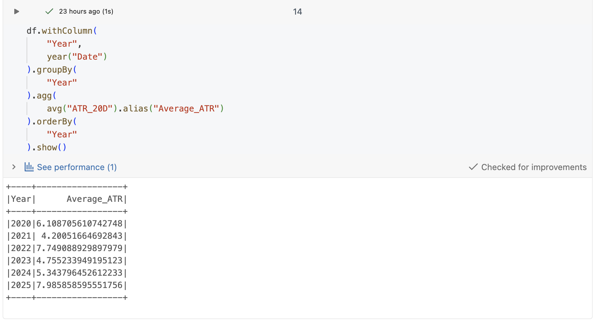
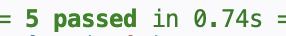

# Trading Data Pipeline

A Data Engineering project that extracts financial market data,
processes it using Pandas and PySpark, stores processed datasets
in CSV and Parquet formats, uploads them to Azure Blob Storage,
and analyzes them in Databricks using Apache Spark.

## Project Workflow

```text
Yahoo Finance
    ↓
Extract Market Data
    ↓
Validate Data
    ↓
Raw CSV Files
    ↓
Pandas Transformations
(daily returns, moving averages, volatility, ATR)
    ↓
Processed CSV / Parquet
    ↓
PySpark Transformations
(daily returns, moving averages, volatility, ATR)
    ↓
Spark Parquet Output
    ↓
Azure Blob Storage
    ↓
Databricks
    ↓
Spark Analysis / Delta Table
```

## Example Output

The pipeline processes multiple market datasets using Pandas,
PySpark and Databricks, enriching the data with daily returns,
moving averages, volatility and ATR before storing the processed
datasets as Parquet files.

### Local PySpark pipeline


### Databricks Analysis

The processed Parquet files are loaded into Databricks where
PySpark is used to perform filtering, transformations and
aggregations.



## Sample Dataset

Tickers:
- SPY (S&P 500 ETF)
- QQQ (Nasdaq 100 ETF)
- GLD (Gold ETF)
- TLT (20+ Year Treasury Bond ETF)

Period:
- 2020-01-01 to 2025-12-31

## Features

- Extract market data from Yahoo Finance
- Clean and structure raw market data with a dedicated `Date` column
- Process multiple market tickers using Pandas and PySpark
- Calculate daily returns
- Calculate moving averages
- Calculate 20-day volatility
- Calculate 20-day ATR (Average True Range)
- Store processed datasets in CSV and Parquet format
- Upload processed Parquet files to Azure Blob Storage
- Analyze processed data in Databricks using Apache Spark
- Use a structured ETL pipeline with configurable tickers, dates and paths
- Verify extraction and transformation logic with automated unit tests

## Data Validation

Before any transformations are applied, the pipeline validates
that:

- Market data is not empty
- Required columns are present
- Data follows the expected schema

This helps fail early and prevents downstream processing errors.

## Unit Testing

The project includes automated unit tests that verify the core
validation and transformation logic.

Current unit tests cover:

- Market data validation
- Daily return calculation
- Moving average calculations

Run the tests with:

```bash
pytest
```



## Azure Upload

The pipeline uploads processed Parquet files to Azure Blob
Storage using a reusable upload function.

Each processed dataset is uploaded automatically, making it
available for cloud-based storage and downstream processing.

## Output Files

The PySpark pipeline currently processes the following tickers:

- SPY
- QQQ
- GLD
- TLT

Each ticker is stored as a separate Parquet output in:

```text
data/spark/
├── spy_spark_processed.parquet
├── qqq_spark_processed.parquet
├── gld_spark_processed.parquet
└── tlt_spark_processed.parquet
```

## Technologies

- Python
- Pandas
- PySpark
- Databricks
- Delta Lake
- Azure Blob Storage
- pytest
- PyArrow
- yfinance
- azure-storage-blob
- python-dotenv
- GitHub Codespaces

## Project Structure

```text
trading-data-pipeline/
│
├── assets/
│   ├── pyspark_output.png
│   ├── databricks_output.png
│   └── pytest_output.png
│
├── data/
│   ├── raw/
│   ├── processed/
│   └── spark/
│
├── databricks/
│   ├── README.md
│   └── notebooks/
│       └── trading_data_pipeline_databricks.py
│
├── src/
│   ├── extract.py
│   ├── transform.py
│   ├── load.py
│   ├── spark_transform.py
│   └── upload_to_azure.py
│
├── main.py
├── requirements.txt
└── README.md
```

## Planned Improvements

- Connect Databricks directly to Azure Blob Storage
- Increase unit test coverage
- Add more advanced logging and error handling
- Make the upload step reusable for different file types and containers
- Explore orchestration with Airflow or another workflow tool